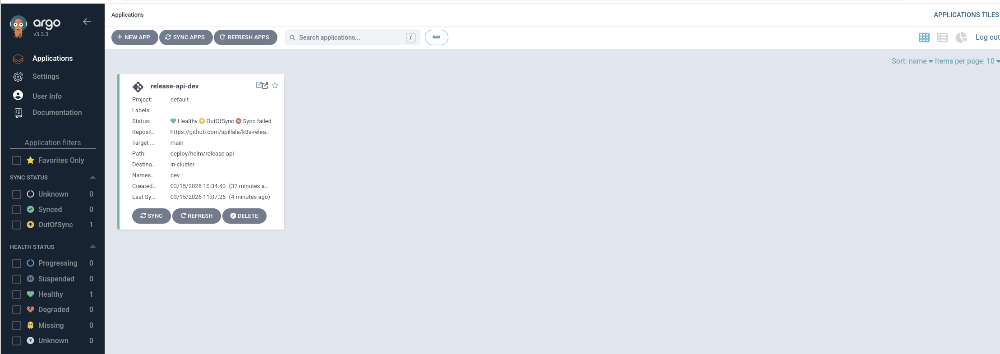
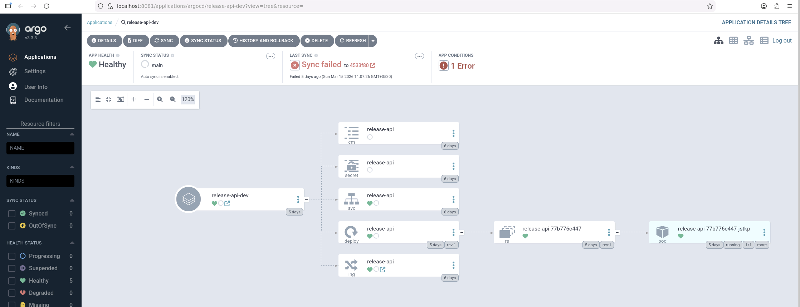
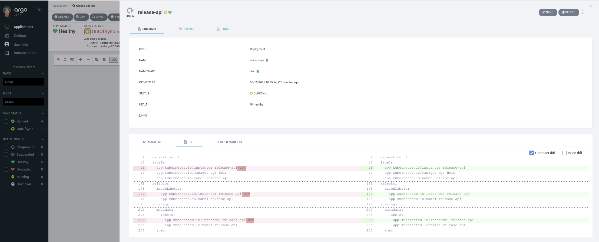

# k8s-release-demo

A portfolio project for demonstrating a Go microservice deployed to `MicroK8s` through a `GitHub Actions` CI pipeline and an `Argo CD` GitOps workflow.

## What This Shows

- Go service development with tests
- Docker packaging
- Helm-based Kubernetes deployment
- Argo CD continuous delivery into MicroK8s
- A structure that feels close to real platform work, but is still finishable on one laptop

## Why This Is Freelance-Relevant

- shows a complete developer-to-cluster workflow instead of just app code
- demonstrates Kubernetes packaging, deployment, and operational endpoints
- mirrors the kind of internal platform work startups ask DevOps freelancers to handle
- gives you a concrete repo to use in proposals for Kubernetes, platform, and release engineering gigs

## Service Endpoints

- `GET /healthz`
- `GET /readyz`
- `GET /version`
- `GET /config`
- `POST /tasks/cache-warm`

## Local Run

```bash
make test
make build
make run
```

Then verify:

```bash
curl http://localhost:8080/healthz
curl http://localhost:8080/version
curl -X POST http://localhost:8080/tasks/cache-warm
```

## Local Kubernetes Flow

1. Install tooling on the remote Ubuntu laptop:

```bash
./scripts/bootstrap-ubuntu.sh
```

2. Re-login to refresh group membership, then verify `MicroK8s`:

```bash
newgrp microk8s
microk8s status --wait-ready
microk8s kubectl get nodes
```

3. Enable cluster add-ons and namespaces:

```bash
make bootstrap-local
```

4. Render Helm templates:

```bash
make helm-template
```

5. Deploy to the `dev` namespace:

```bash
make local-deploy IMAGE_TAG=dev
```

6. Access the service:

```bash
make port-forward
```

In another terminal:

```bash
curl http://localhost:8080/healthz
curl http://localhost:8080/readyz
curl http://localhost:8080/version
curl http://localhost:8080/config
curl -X POST http://localhost:8080/tasks/cache-warm
```

## Argo CD Flow

- Argo CD watches the Helm chart at `deploy/helm/release-api`
- The app manifest lives at `deploy/argocd/release-api-dev.yaml`
- The target namespace is `dev`
- CI validates the project on each push to `main`

## Argo CD GitOps Demo

Argo CD is installed in the local `MicroK8s` cluster and manages the `release-api-dev` application from this GitHub repository.

### What This Demonstrates

- GitOps-style application management on Kubernetes
- Argo CD watching the repo and reconciling desired state from `main`
- a real app graph with `ConfigMap`, `Secret`, `Service`, `Deployment`, `ReplicaSet`, `Pod`, and `Ingress`
- a workflow that is much closer to production platform engineering than a manual `kubectl apply` demo

### Argo CD Application

- Application name: `release-api-dev`
- Namespace: `argocd`
- Destination namespace: `dev`
- Source repo: `https://github.com/spillala/k8s-release-demo.git`
- Chart path: `deploy/helm/release-api`
- Target revision: `main`

### Current Argo CD Status

The application is currently:

- `Healthy`
- `OutOfSync`
- `Auto Sync enabled`

This is still useful portfolio evidence because it proves:

- Argo CD is installed and working
- the application is connected to GitHub
- the release is visible and managed through the Argo CD UI
- the workload is running in the cluster while Argo CD reports remaining drift to be resolved

### Screenshot Evidence

Suggested caption for the Argo CD screenshot:

> Argo CD managing the `release-api-dev` application on a local MicroK8s cluster, showing GitOps tracking from the `main` branch.

Suggested caption for the application detail screenshot:

> Application graph for `release-api-dev`, including Kubernetes resources created from the Helm chart and reconciled by Argo CD.

### Screenshots

Add your screenshots to `docs/images/` in this repository, then they will render on GitHub here.

#### Argo CD Applications View



#### Argo CD Application Graph



#### Argo CD Deployment Diff



### Current Sync Issue

Argo CD is currently reporting the application as `Healthy` but `OutOfSync`.

From the deployment diff, the remaining drift is the `app.kubernetes.io/instance` label:

- live deployment uses `release-api-dev`
- desired deployment uses `release-api`

This usually happens when a Helm release was first created with one release name and later managed by Argo CD with a different rendered release identity. The workload is still running correctly, but Argo CD cannot fully reconcile until the live deployment matches the desired selector and pod-template labels.

This is still valuable portfolio evidence because it shows:

- Argo CD is installed and connected to GitHub
- the app is being reconciled through GitOps
- the workload is healthy in Kubernetes
- there is a real operational drift/debugging scenario being investigated

## Architecture

```text
Developer change
  -> Go service build and tests
  -> Docker image build
  -> image import into MicroK8s
  -> Helm deploy into dev namespace
  -> Service exposure through ClusterIP + port-forward

Future state
  -> GitHub Actions CI
  -> registry publish
  -> Argo CD sync into MicroK8s
```

## GitOps Architecture

```text
GitHub repo (main branch)
  -> Argo CD Application in argocd namespace
  -> Helm chart at deploy/helm/release-api
  -> desired state rendered by Argo CD
  -> release-api deployed into dev namespace
  -> health and sync visible in Argo CD UI
```

## Suggested Demo Evidence

- `microk8s kubectl -n dev get pods,svc,deploy`
- `curl http://localhost:8080/version`
- `curl -X POST http://localhost:8080/tasks/cache-warm`
- `microk8s kubectl -n dev logs deploy/release-api`

## Sample Run Output

These are real outputs captured from the project running on the remote Ubuntu laptop with `MicroK8s`.

### Kubernetes Status

```bash
$ microk8s kubectl -n dev get pods,svc,deploy
NAME                               READY   STATUS    RESTARTS   AGE
pod/release-api-58d9d8b4cc-l6295   1/1     Running   0          7h23m

NAME                  TYPE        CLUSTER-IP       EXTERNAL-IP   PORT(S)   AGE
service/release-api   ClusterIP   10.152.183.171   <none>        80/TCP    9h

NAME                          READY   UP-TO-DATE   AVAILABLE   AGE
deployment.apps/release-api   1/1     1            1           9h
```

### Version Endpoint

```bash
$ curl http://localhost:8080/version
{"appName":"release-api","environment":"dev","version":"dev","gitSha":"local","buildTime":"2026-03-14T08:02:56Z"}
```

### Operational Task Trigger

```bash
$ curl -X POST http://localhost:8080/tasks/cache-warm
{"status":"accepted","task":"cache-warm","executedAt":"2026-03-14T17:43:21Z"}
```

### Application Logs

```bash
$ microk8s kubectl -n dev logs deploy/release-api | tail -10
2026/03/14 17:42:58 method=GET path=/readyz remote=192.168.86.27:59796
2026/03/14 17:43:05 method=GET path=/healthz remote=192.168.86.27:44802
2026/03/14 17:43:08 method=GET path=/readyz remote=192.168.86.27:44810
2026/03/14 17:43:15 method=GET path=/healthz remote=192.168.86.27:50862
2026/03/14 17:43:16 method=GET path=/version remote=127.0.0.1:35260
2026/03/14 17:43:18 method=GET path=/readyz remote=192.168.86.27:50878
2026/03/14 17:43:21 method=POST path=/tasks/cache-warm remote=127.0.0.1:34044
2026/03/14 17:43:21 task=cache-warm env=dev source=api
2026/03/14 17:43:25 method=GET path=/healthz remote=192.168.86.27:51818
2026/03/14 17:43:28 method=GET path=/readyz remote=192.168.86.27:51830
```

## Next Steps

- Push container images to `GHCR`
- Update Helm values automatically from CI after image publish
- Install Argo CD into MicroK8s and apply the application manifest
- Add screenshots and a short demo video before publishing this as a portfolio repo

For local laptop development, the `dev` environment uses a locally imported image with `imagePullPolicy: Never`. For GitHub-hosted CI/CD later, override `image.repository` with your remote registry image and switch the pull policy back to `IfNotPresent`.
